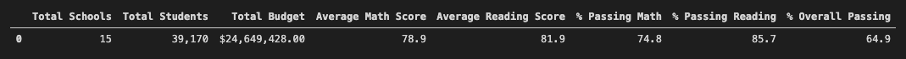
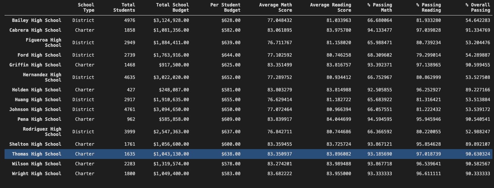
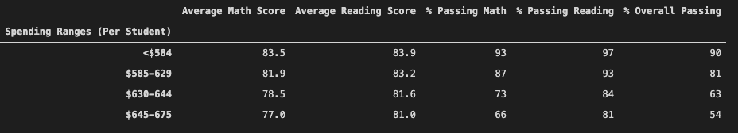
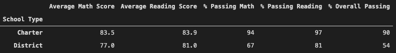

# School_District_Analysis
## Overview of the school district analysis
A school board would like to analyze student data because of suspected academic dishonesty.  Reading and math grades for Thomas High School ninth graders appear to have been altered although the school board does not know the full extent of the academic dishonesty.  Maria has asked me to help analyze the dataset and replace the math and reading scores for Thomas High School with NaNs while keeping the rest of the data intact.

The school board has requested the following deliverables for the analysis.
- A district summary
- A school summary
- The top 5 and bottom 5 performing schools, based on the overall passing rate
- The average math score for each grade level from each school
- The average reading score for each grade level from each school
- The scores by school spending per student, by school size, and by school type

## Results
- How is the district summary affected?
  - The average math score decreased ~1%.
  - The percentage of students passing math decreased ~1%.
  - The average reading did not seem to be affected.
  - The percent of students passing reading decreased ~1%.
  - The overall passing rate dropped ~1%.
  
  

- How is the school summary affected?
  - Thomas High School was the only school to be affected by the changes.
  - The percentage of students passing math dropped significantly from 93.2% to 66.9%.
  - The percentage of students passing reading dropped significantly from 97.3% to 69.7%.
  - The overall passing percentage also significantly dropped from 90.9 to 65.1%.
  
  

- How does replacing the ninth graders’ math and reading scores affect Thomas High School’s performance relative to the other schools?
  - Thomas High School’s performance should drop relative to the other schools.

- How does replacing the ninth-grade scores affect the following
  - The math and reading scores by grade remained the same for all schools other than the 9th grade at Thomas High School which had no data becasue we removed those records.
  - Scores by school should decrease with the updated dataset.
  - Scores by school size should decrease with the updated dataset.
  - Scores by school type should decrease with the updated dataset.
  
  
  
  

## Summary
Four major changes in the updated school district analysis after reading and math scores for the ninth grade at Thomas High School have been replaced with NaNs.
- The percentage of students passing math dropped significantly at Thomas High School.
- The percentage of students passing reading dropped significantly at Thomas High School.
- The overall passing percentage also significantly dropped at Thomas High School.
- Thomas High School’s performance dropped relative to the other schools.
